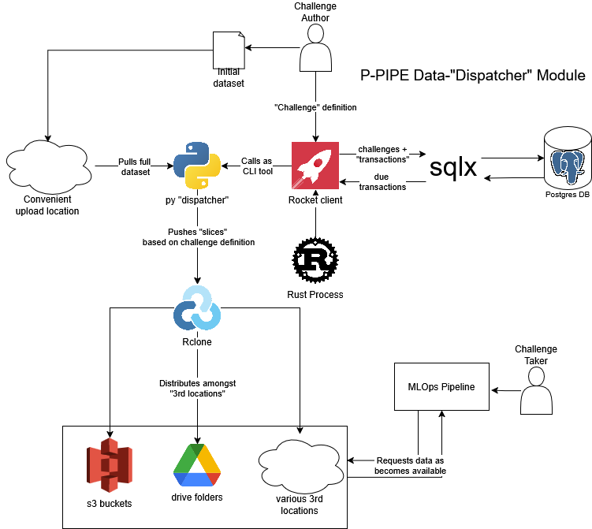

# P-pipe

P-PIPE, the *Production-Pipeline and Infrastructure Preparation Exercise*, is created to serve as part of a learning platform for teaching students and professionals [Machine Learning Operations](https://en.wikipedia.org/wiki/MLOps) (MLOps). It does this by providing tools for teachers to use their data to create 'challenges' that as mirror real-world scenarios as closely as possible. At the same time, it provides frameworks to measure the performance of student solutions by relevant metrics such as uptime, latancy, data compliance, and more, as opposed to existing solutions that lean towards single-digit model-focused metrics such as accuracy.

P-pipe is meant to provide teachers with tools to challenge their students' practical applications of skills they'll use in real life. This is meant to bridge the significant gap between the often theoretical and model-centric knowledge data scientist are taught at university and learning institutions, and the skills they require for day-to-day tasks in the industry.

The program is made as part of the Master's Thesis of Karl Meisner-Jensen, supervised by [Nicki Skafte Detlefsen](https://skaftenicki.github.io/) at [DTU compute](https://www.compute.dtu.dk/). Started August 2025 and ending February 2026

## Program Structure

Overall, work on the program as a whole is meant to be split between three main parts:

### Data Orchestration and Dispatch (DOD)

The DOD is meant to handle:
- Challenge creation based on user specifications
- Creation of individual data 'transactions' from a challenge
- Intermittent upload of data to 3rd locations based on data transactions

A rough sketch of the components is shown below:

  

Rust runs a Rocket client which serves endpoints. This in turn, communicates through [sqlx](https://github.com/launchbadge/sqlx) with a postgres database, which holds all current challenges and transactions. The transactions are generated after a challenge is submitted, and are made to be more or less 'atomic' in the sense that they can each be executed given exactly what is contained within one, with no added information needed. The transactions therefore, are more of a conveinence value generated to let users and developers keep an overview of future actions performed by the backend.

Each transaction contains something akin to a 'due by' value. The backend intermittently checks if any transactions are past their due by date, after which they are passed as .json files to a python script that runs through a CLI interface (made with [Click](https://click.palletsprojects.com/en/stable/)). The python "dispatcher" is a barebones script that uses [Rclone](https://rclone.org/) with [rclone-python](https://pypi.org/project/rclone-python/) to push pieces of the intiail dataset submitted by the challenge author, to 3rd locations based on the transaction specifications, which are in turn made from the challenge specficiations.

This way of passing jsons ensures somewhat simple testability, since each failed transaction can be retaken and passed directly to the python script again, with no input needed from the rest of the backend.

Integration tests regarding the database are handled by sqlx spinning up temporary databases based on migration scripts, with lifetimes limited to the test scope,

### Judgement Module

Second priority for development meant to provide capability to monitor student performance either by submitting requests for the student to show they have recieved or trained a model on specific data upload, or by submitting requests for predictions to a student-made endpoint  .

### Frontend

Third priority for development. Meant to be a barebones interface for uers to create and monitor challenges.

